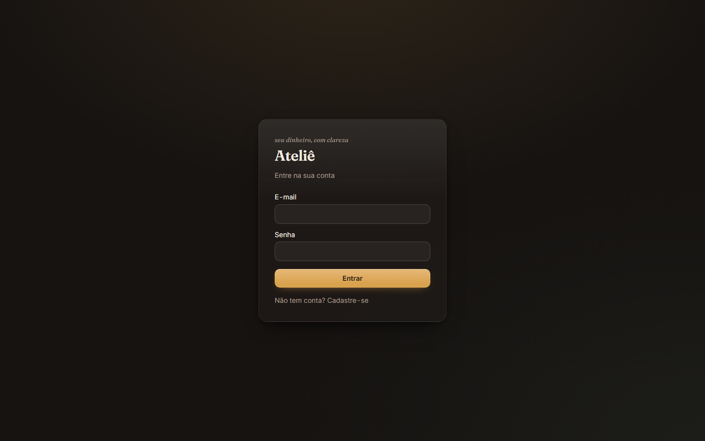
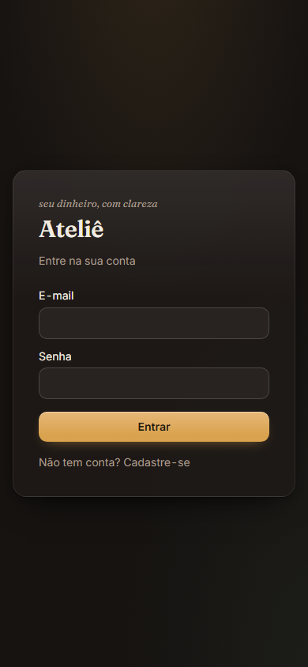

# Ateliê — gestão financeira pessoal

> **EN:** Personal finance app (Next.js 16 + Supabase) built around ledger integrity. Money is stored as integer cents. Every write goes through an atomic PostgreSQL RPC protected by row-level security. Business rules are enforced by database constraints and by SQL test suites that run against a real Postgres in CI.

[](https://github.com/Lucasbritorj/financeiro/actions/workflows/ci.yml)


O Ateliê é um aplicativo de finanças pessoais com foco em **integridade do razão**. Ele cuida de:

- cartões, faturas e parcelamento;
- importação de extrato (CSV, OFX, XLSX e PDF), com deduplicação e conciliação do pagamento de fatura;
- orçamento por categoria, cofrinhos, boletos e recorrências.

<p align="center">
  
  
</p>

## Decisões de engenharia

| Problema | Decisão |
|---|---|
| Erro de arredondamento em dinheiro | Todo valor é um **inteiro em centavos** (`bigint`). A conversão para decimal acontece só na borda da tela (`src/lib/money.ts`), e um hook de edição barra aritmética monetária em float fora desse arquivo. |
| Escrita parcial e condição de corrida | Toda escrita relacional passa por uma **RPC atômica** em PL/pgSQL: `SECURITY DEFINER`, `search_path` vazio e `FOR UPDATE` onde há disputa. As roles do cliente não têm permissão de escrita direta (DML revogado). |
| Vazamento de dados entre usuários | **RLS** em todas as tabelas e `security_invoker` em todas as views. Uma suíte de isolamento entre usuários roda no CI. |
| Importar o mesmo extrato duas vezes | Cada lançamento tem um fingerprint, protegido por índice único parcial. Reimportar não duplica nada, e o pagamento de uma fatura é conciliado uma única vez. |
| Regra de negócio que só existe no código da tela | As invariantes vivem em **constraints do banco e em asserts SQL**: a soma das parcelas é igual ao total, uma fatura paga não reabre e o limite de crédito é serializado. |
| Erro sem explicação para o usuário | As RPCs usam códigos de erro estáveis (`FW400` a `FW500`), cada um com uma dica de como resolver, que a interface mostra direto. |

## Qualidade

- **CI no GitHub Actions:**
  - typecheck e lint;
  - testes unitários (`node:test`) e de componente (Vitest);
  - build;
  - migrações e asserts rodando em **Postgres 17 real**.
- **Gates estáticos sobre as migrations:**
  - `search_path` seguro nas funções `SECURITY DEFINER`;
  - `security_invoker` nas views;
  - privilégios das RPCs;
  - isolamento por usuário.
- **Deploy contínuo** na Vercel.

## Stack

Next.js 16 (App Router) · React 19 · TypeScript · Tailwind CSS 4 · Supabase (Postgres, Auth, RLS, pg_cron) · Vitest · GitHub Actions · Vercel.

## Rodar localmente

```bash
npm ci
npm run dev
```

Antes do `npm run dev`, crie um `.env.local` a partir do `.env.example`, com a URL e a chave anon do seu projeto Supabase. O passo a passo do banco está em [Setup](#setup).

Para testar:
- `npm test`: testes unitários;
- `npm run test:componentes`: testes de componente;
- `npm run test:sql`: asserts SQL (exige Docker).

## Autor

Lucas Brito · [github.com/Lucasbritorj](https://github.com/Lucasbritorj)

Licença [MIT](LICENSE).

---

# Documentação técnica


## Setup

1. Crie um projeto em [supabase.com](https://supabase.com).
2. No **SQL Editor**, execute **todas** as migrações de `supabase/migrations/`
   em ordem numérica — são **27**, de `0001` a `0027`. Aplicar só o núcleo
   (`0001`–`0006`) sobe um banco sem categorias, importação, cofrinhos,
   análise, carteira, boletos nem recorrências: telas que o app oferece falham
   contra objetos que não existem. Ordem importa — `0002` e `0003` são
   `CREATE OR REPLACE`: re-execute as versões atuais **antes** de `0005`, que
   revoga o DML direto.

   *Núcleo transacional (transações, faturas, cartões):*
   - `0001_nucleo_transacional.sql` (tabelas, índices, RLS, cascata de soft delete)
   - `0002_processar_transacao_completa.sql` (motor de parcelamento + guard de limite + trava de fatura liquidada)
   - `0003_processar_pagamento_fatura.sql` (colunas de auditoria + máquina de estados de pagamento)
   - `0004_faturas_unique_parcial.sql` (unicidade só entre faturas ativas — soft delete não trava competência)
   - `0005_blindagem_privilegios.sql` (least privilege: REVOKE de DML direto, fim do DELETE físico, RPC `criar_cartao`, view `vw_faturas_consolidadas`)
   - `0006_ciclo_e_exclusao.sql` (updated_at universal + trigger, RPCs `excluir_transacao`/`excluir_cartao`, `fechar_faturas` para o ciclo ABERTA→FECHADA)

   *Assistente (categorias, importação, cofrinhos, carteira, boletos, recorrências):*
   - `0007_editar_transacao.sql`
   - `0008_categorias_e_regras.sql`
   - `0009_importacao.sql`
   - `0010_cofrinhos.sql`
   - `0011_substituir_transacao.sql`
   - `0012_carteira_caixa.sql`
   - `0013_boletos.sql`
   - `0014_estorno_recorrencia_cron.sql`
   - `0015_recorrencias.sql`
   - `0016_importacao_formatos.sql`

   *Endurecimento, auditoria e correções:*
   - `0017_endurecimento_auditoria.sql`
   - `0018_importacao_guard_valor.sql`
   - `0019_correcoes_auditoria_graph_loop.sql`
   - `0020_importacao_dedup.sql`
   - `0021_importacao_revisao_source_sha.sql`
   - `0022_security_hardening.sql`
   - `0023_conciliacao_fatura_extrato.sql`
   - `0024_excluir_cofrinho.sql`
   - `0025_regex_fatura_paga_itau.sql`
   - `0026_fingerprint_lancamento_manual.sql`
   - `0027_rls_auto_enable_event_trigger.sql`
   - `20260909205952_corrigir_integridade_transacional_importada.sql`
   - `20260929120000_confirmar_importacao_fatura_ja_paga.sql`

   > Os bundles de `supabase/APLICAR.md` cobrem apenas até `0019`. De `0020`
   > em diante, aplique os arquivos de `supabase/migrations/` direto.
   >
   > A última entrada troca o prefixo sequencial (`00NN_`) pelo timestamp do
   > Supabase CLI. Aplique por ordem alfabética do nome do arquivo, que é a
   > mesma ordem cronológica — `2026…` vem depois de `0027`.
3. (Opcional) Execute `supabase/tests/verificacao_nucleo.sql` — 21 asserts
   cobrindo divisão centesimal, Falha do Dia 31, corte de fechamento,
   idempotência, limite de crédito, máquina de estados (pagar/fechar),
   sanidade temporal, privilégios, exclusões soft e a view de estornos;
   termina em `ROLLBACK`, sem persistir nada.
4. Agende o fechamento diário do ciclo (Database → Cron, extensão `pg_cron`):
   `select cron.schedule('fechar-faturas', '10 3 * * *', $$select public.fechar_faturas()$$);`
   (`fechar_faturas` é administrativa — clientes não conseguem executá-la.)
5. Copie `.env.example` para `.env.local` e preencha com os valores de
   **Settings → API** do projeto.
6. **Confirm email** fica ligado por padrão (`enable_confirmations = true` em
   `supabase/config.toml`, enforçado por `tests/unit/supabase-auth-config.test.ts`).
   Para testar sem confirmar e-mail a cada cadastro, use o inbucket local em
   http://127.0.0.1:54324 — ele intercepta todo e-mail enviado pelo `supabase start`
   e mostra o link de confirmação, sem precisar desligar a checagem.
7. `npm install && npm run dev` e acesse http://localhost:3000.

## Testes locais

- `npm test` — unitários (node:test, roda `.ts` nativo no Node 24).
- `npm run test:sql` — Postgres 16 efêmero em Docker: shim do ambiente
  Supabase + migrações na ordem + os 21 asserts do núcleo.
- CI (`.github/workflows/ci.yml`) roda os mesmos gates em push/PR.

## Estrutura

- `supabase/` — migrations e script de verificação (fonte da verdade do schema).
- `src/proxy.ts` — renova a sessão Supabase e protege as rotas (Next 16 renomeou `middleware` para `proxy`).
- `src/lib/supabase/` — clients browser (`client.ts`) e server (`server.ts`, cookies via `@supabase/ssr`).
- `src/lib/database.types.ts` — tipos do schema (regenere com `npx supabase gen types typescript --project-id <id>`).
- `src/lib/money.ts` — conversão reais ↔ centavos na borda da UI.
- `src/app/(protegido)/` — telas de transações, faturas e cartões (leitura direta sob RLS).

## Regras de negócio do motor

- Compra com dia >= dia de fechamento entra na fatura do mês seguinte.
- Dia inexistente no mês (ex.: 31 em fevereiro): usa o último dia do mês, nunca rola para o próximo.
- Vencimento cai no mês seguinte à competência quando `dia_vencimento <= dia_fechamento`.
- Pagamentos não-crédito geram 1 parcela sem fatura (fluxo de caixa unificado).
- Parcelas só entram em faturas `ABERTA`; faturas são criadas sob demanda com `ON CONFLICT` (à prova de corrida).
- Limite de crédito: `SUM(parcelas PENDENTES de DESPESA)` + nova compra não pode exceder `limite_total`; cartão é lockado (`FOR UPDATE`) para serializar transações concorrentes. Estouro dispara `FW429`.
- Pagamento de fatura (`processar_pagamento_fatura`): fatura vira `PAGA` e as parcelas filhas são baixadas em lote com `data_pagamento`; repagamento dispara `FW409`.
- Erros das RPCs carregam SQLSTATE estável (`FW400/401/404/409/429`) + `hint` com remediação — ver CLAUDE.md.

Após aplicar migrações, regenere `src/lib/database.types.ts`
(`npx supabase gen types typescript --project-id <id>`).

## Segurança

- **Least privilege no banco** (0005): clientes só leem (RLS por usuário);
  toda escrita passa por RPC `SECURITY DEFINER` com escopo por `auth.uid()`.
  DELETE físico é impossível (privilégio revogado + policies dropadas).
- **View com `security_invoker`**: consultas analíticas respeitam a RLS.
- **Headers HTTP** (`next.config.ts`): X-Frame-Options, nosniff,
  Referrer-Policy, Permissions-Policy.
- **Checklist do painel Supabase em produção**: `Confirm email`, senha mínima
  >= 8 e o rate limit de signup/signin (`sign_in_sign_ups`) são enforçados em
  `supabase/config.toml` por `tests/unit/supabase-auth-config.test.ts` — o
  teste garante que o **arquivo versionado** está correto, não que o projeto
  remoto está: só reflete em produção depois de `supabase config push`. Fora
  do que o teste cobre: ative **PITR/backups** no plano; nunca exponha a
  `service_role` key no cliente (o app usa apenas a anon key + sessão).
